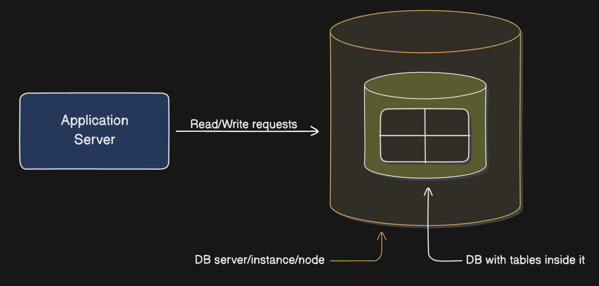
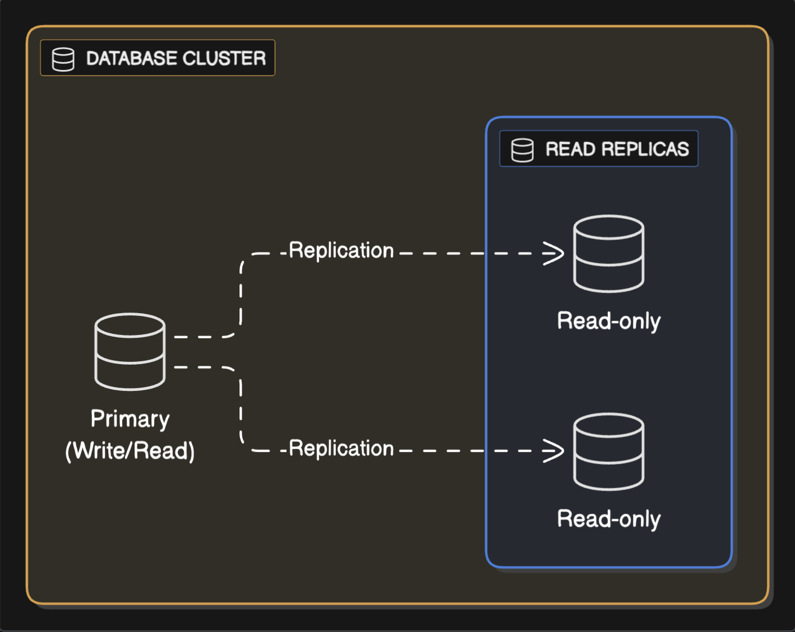
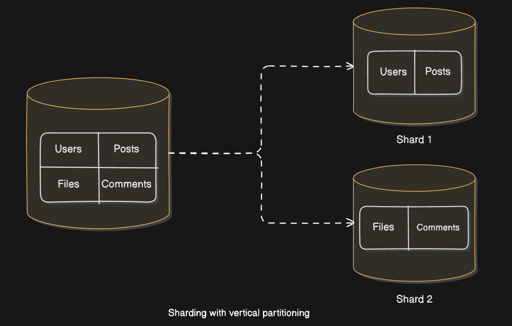
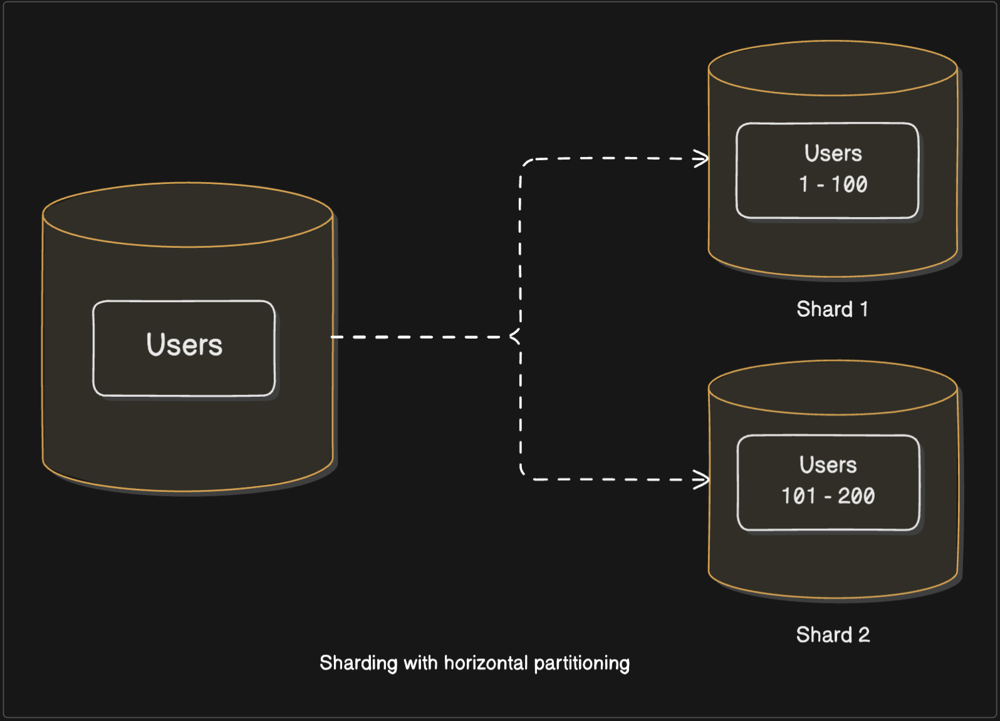

## Introduction

Imagine you start your software company. Initially you've a single database node/server with a single database and a few tables inside it. Since our application is new with lesser number of users, this single database node can efficiently handle all the database traffic (i.e. read and write requests).

Now as the number of users grow, two things happen primarily: data grows and the number of queries on that data increases. The consequence of this is the increase in: CPU utilisation, disk utilisation and query execution time.

Therefore, there are essentially two overarching goals when it comes to database scalability:

- Allowing data to grow larger than the capacity of a single node (i.e. reducing disk utilisation).
- Load balancing the read and write requests efficiently across the nodes (i.e. reducing CPU utilisation and query execution time).

Keep in mind these two goals as you read further since the database scaling techniques that we'll be reading about, at the core, aim to achieve these two goals.

## Vertical scaling

The most straightforward way to achieve the above goals is by simply increasing the compute, memory and/or storage capabilities of the database node, so as to meet your application needs. This is known as vertical scaling.

Basically increasing the capabilities of a single machine so that we can store more data and alongside process more number of requests.

But as you might be guessing there are disadvantages to this approach:

- Scaling up a single node infinitely is not possible - there's a limit to how much a single machine can handle. This is the primary downside of vertical scaling from _scalability_ perspective.
- A single node also acts as a single point of failure - if the node crashes for some reason, there's no way for us to serve user requests. This is more of a downside from the perspective of _fault tolerance_.

So how do we tackle these problems as your company is continuously growing? Enters: Horizontal scaling.

## Horizontal scaling

> _"A truly scalable system is always horizontally scalable"_

That is a bold claim, but we'll try to justify it. So what is horizontal scaling?
Instead of trying to increase the capabilities of a single node (as in vertical scaling), we try increasing the _number_ of nodes itself. A collection of such nodes is called a cluster.

The essence of horizontal scaling is increasing the number of machines and then distributing our data across those machines.

So suppose you have created more number of database nodes for your application. But how do you distribute your data?

There are typically two ways we can go about horizontal scaling: Replication and Sharding.

### Replication

Replication involves duplicating an entire dataset (or a subset of it) across multiple nodes.
Each replica of the original dataset contains exactly the same data.

Which database scalability goals do you think this might solve?
Obviously it doesn't solve the first goal: replicating the data doesn't increase the total storage capacity of our system. Also, it doesn't increase our ability to handle write requests - if anything, replication actually makes writes a bit complex.
Replication solves only part of the second goal: handling read queries. These replicas you create are also knows as "read-replicas" and are meant only for reading data.

Replication enables to load balance the read queries across the read-only replicas in the cluster. This is helpful when there's high volume of application read traffic.

So all the write requests still go to the primary database node (aka the master or the leader) but the read requests can be distributed across the replicas (aka slaves or followers). The data in the replica nodes is synchronised with the primary node periodically to ensure data consistency.

Apart from scalability, replication also serves to solve another problem: fault tolerance - if one of the nodes (i.e. read-replicas) crashes, read requests can still be served by other replica nodes.

But, of course, just serving the read traffic might not be enough for your ever growing application which involves people bugging you for data all the time. We need to pivot to a better strategy.

### Sharding

Before we go into details of what exactly is database sharding, let us take a small detour and first understand a related term - _data_ partitioning. It is important to understand this term first, because the line between data partitioning and database sharding often gets blurred by the virtue of them being used together.

**Partitioning** is simply: splitting of data into smaller partitions. There are actually two ways you can go about splitting the data:

- Vertical partitioning - splitting of data by columns or tables. A database can be split by moving some columns and/or tables into a different database. For e.g. if there's a column in one of your tables which holds a lot of data but isn't accessed as frequently, you can move that column to a separate table. Similarly, we can move relatively unrelated tables into separate databases. However, each of these databases are still within the same node - we've just virtually split our data not physically.
- Horizontal partitioning - splitting of data by rows. As your application grows, you might be having a growing number of rows in your tables. You can split these rows into separate partitions. Each partition is still inside the same database node.

You see, both vertical and horizontal partitioning give us some sort of performance or data organisation related improvements. But partitioning alone does not help us achieve our scalability goals because we're still bound by the compute capabilities of one database node.
So, we need to move our partitions into separate database nodes. Enters: Sharding.

Sharding is the concept of physically splitting data across multiple nodes. Each such node is called a shard. Note that in partitioning, the data split was sort of virtual. All the partitioned data still resided inside the same node. Now we move that data to separate nodes.

Sharding can be combined with both vertical and horizontal partitioning.

In around 2022, the Figma infrastructure team did what they call "vertical partitioning" of their database system, where they vertically partitioned their database by table(s)[^1]. But they did not just move the tables to separate database within the same node but actually to separate database nodes. In essence what they did was: move a group of tables into different database nodes (RDS instances).

This helps distributing the read/write requests to different nodes (shards). So this does solve our 2nd scalability goal to some extent.

But this approach does not scale well as the size of data and the no. of requests on that data grows, simply because the smallest unit of a vertical partition is still a table. So if the data in one of the tables in a database node grows beyond the capabilities of that node, we have a problem. In the figure above all the users' data is still stored in shard 1. As the no. of users grow beyond what could be stored/processed by that shard, we'll start facing our bottlenecks.

Comes the final solution - **Sharding combined with horizontal partitioning** - often referred to as horizontal sharding. In general sense, this is what people mean when they mention the term sharding. Here we'll horizontally partition our data and put these partitions into separate shards.

With this approach we can kind of achieve both of our scalability goals. Our data can grow virtually infinitely - each time a node reaches its capacity, we add a new node.
Also, the load can now be distributed across these nodes giving us a truly scalable system.

Our scalability approach seems solid now. But like anything in this world which seems too good, it comes with its downsides and we have to be aware of them before we shard our database:

- Since the data is split across different nodes, it is difficult to enforce foreign key constraints and unique indexes.
- If our database is normalised, performing SQL JOIN operations is inevitable. But JOINs become quite difficult and expensive since you'll have to bring data from different nodes and manually join them. If you've to access several database nodes to fulfil one request, the entire act of sharding proves to be counterproductive.
- Transactions now have to span multiple shards and it becomes to difficult to ensure data consistency and integrity.

## Final thoughts

It is extremely important to assess if handling these issues is even worth it for your application.

Bottom line: The perfect database scaling technique is the one which serves your application needs and at the same time is not an overkill.

[^1]: There's quite a story behind how Figma scaled their database architecture step-by-step: vertical scaling -> replication -> [vertical partitioning](https://www.figma.com/blog/how-figma-scaled-to-multiple-databases/) -> [sharding](https://www.figma.com/blog/how-figmas-databases-team-lived-to-tell-the-scale/).
