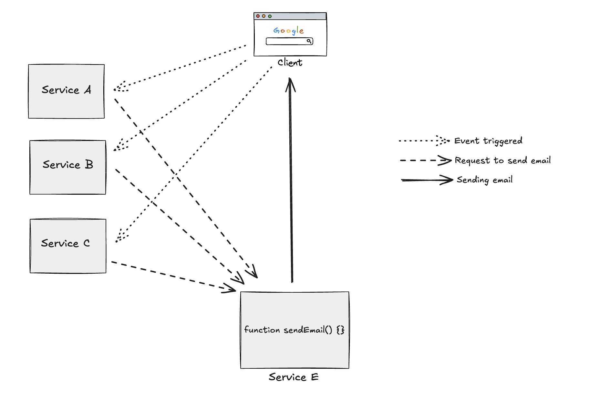
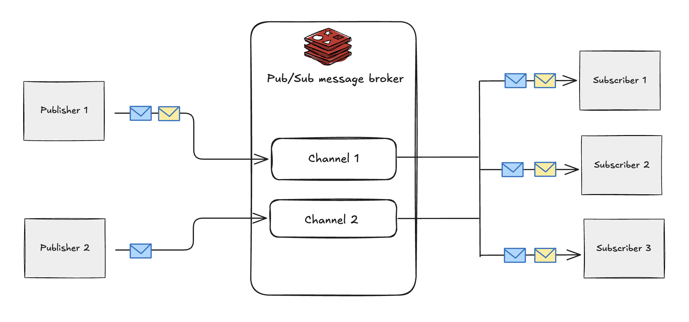
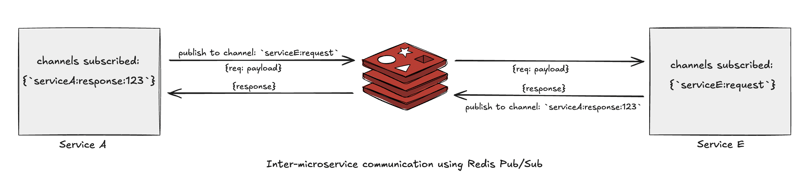

## Introduction

As a junior engineer, I was once posed with a task: establish communication between our microservices using Redis Pub/Sub to help them communicate a particular kind of task. This is a post about what I did to accomplish this task, what issues I didn't take into account, and why pub/sub was not an ideal solution for what we were trying to achieve.

Let's start with the use case first.
Our application required sending emails to users when certain events were triggered across the system. These events originated from multiple microservices, but the email sending logic was centralized in a single microservice. For clarity, we'll refer to the email service as `E` and the event-generating services as `A`, `B`, and `C`.

We decided to implement this communication using Redis Pub/Sub.

## What is Redis Pub/Sub ?

Pub/Sub is a messaging pattern meant for facilitating communication between different components of a distributed-like system. This pattern typically involves two parties: a _publisher_ that publishes events or messages to a topic (also known as a channel) and a subscriber that subscribes to topics of interest. A system may involve multiple publishers and subscribers.

Redis's [implementation](https://redis.io/docs/latest/develop/pubsub/) of Pub/Sub is a lightweight messaging protocol ideally designed for broadcasting messages within a system.

If you want to know how redis implements pub/sub internally, I would recommend [this excellent blog](https://jameshfisher.com/2017/03/01/redis-pubsub-under-the-hood/) by Jim Fisher. But here I'll just mention a few most important points to consider about Redis pub/sub:

- In pub/sub the publishers publish message(s) to some channels and all the subscribers subscribed to a particular channel receive a copy of that message. Essentially the message is _broadcasted_ to _all_ the subscribers.
- The publishers and subscribers are decoupled in that a publisher holds no knowledge what subscribers may exist in the system and vice-versa.
- Redis Pub/Sub is an at-most-once messaging system. If a message is published and there is a system failure, the message might be lost forever. It does not feature any kind of persistence or acknowledgements of messages by default.
- Pub/Sub based communication is in contrast with a traditional point-to-point communication (like a simple API call) where the sender(s) send messages directly to the intended receiver(s).

This last point that I mentioned is actually very important for our use case. What we were trying to achieve was indeed point-to-point communication, but through pub/sub.

How, you ask? We had an idea. But before I go into that, let me first explain why we even chose pub/sub for this purpose in the first place.

Our premise was simple. Whenever an event was triggered in any of these services `A`, `B`, or `C`, they would publish a message to a Pub/Sub channel. Service `E` would consume these messages from the channel and then send emails. Service `E` would then send an acknowledgement back to the publishers so that they know their emails have been sent.

If you look at it, you'll realise that this is not a broadcast but rather a request-response based communication strategy. One service sends a request to exactly another service to perform a task and then gets a response in return. But this is what you would do through an API call. In fact for all the other purposes of inter service communication we did use standard REST APIs. We went for pub/sub for two reasons primarily:

- Redis is fast and was already a part of our application's architecture. We were already using Redis for caching and other purposes, so we thought why not leverage it to make our communication faster. We did not want to include some full-fledged message queueing system like RabbitMQ or SQS just for this functionality.
- We were okay with the downsides that Redis Pub/Sub comes with. Because there's no persistence or retry logic, there's a chance that there will be some emails that will never be sent. Our business requirements were not as strict and allowed for this room of loss.

## Using Pub/Sub for inter service communication

We thought of a way to mimic request-response model using the Pub/Sub model to communicate events between different services.

The key here would be to create dedicated request and response channels for sending and receiving requests and responses.

Let us take an example flow of communication between two services: `E` and `A`

1. Create a request channel for service `E` to subscribe to: `serviceE:request`.
2. Now we can publish a message from `A` to this channel which will include email related data like subject, body, recipients etc.
3. After sending the request from service `A`, you'll need to set it up to listen for the response that service `E` might send. For this, create a unique response channel like `serviceA:response:<some_random_id>` and then subscribe to it. Remember to send this channel along with your message payload so that service `E` knows where to publish the response for this request.
4. Service `E` upon receiving the message, will send the email and will publish the acknowledgment to the channel `serviceA:response:<some_random_id>` which will be received by service `A`.
5. After the response is received, unsubscribe from the response channel in service A.

This way we're mimicking the request-response model by making it _apparent_ point-to-point communication, though in reality the services are interacting via Redis and not directly with each other.

## Challenges

Here's a little confession: initially when I implemented this, I was kind of proud of my work. It was working fine, emails were being sent and things were okay. I did not think about scenarios where my implementation would fail...until the application went in production and we had to scale our services.

If you followed the implementation that I described above, you would realise the problem that would come when we horizontally scale our services. Suppose I create 2 instances of service `E`. Both the instances would have subscribed to the request channel `serviceE:request`. Because pub/sub broadcasts all the messages in a channel to all the subscribers, whenever a message for email is published to the channel by any of the other services, it will be received by both the instances of `E`. This will cause the same email to be sent twice - redundant work.

We thought about how this could be fixed. We wanted each message to be processed at most once, but not more than that. So what if we can limit the number of subscribers per channel to at most one? This will ensure only one instance will process a message and send the email. But there are a few problems with this solution:

- The first one is obvious: if you limit the number of subscribers to 1, that would mean all the emails will always be dependent on only one instance to be sent. Basically, our email sending functionality will not be able to benefit from our service scaling. We were fine with this as we did not expect the email part of our application to grow too much in scale.
- Suppose there are 3 instances of service `E` running, but only one of them will be subscribed to the channels to receive the messages from other services. What happens if this instance crashes? Until this instance comes back up and subscribes to the channel again, all the messages will be lost. There is no automatic leader election in case the subscriber instance goes down.

Even if we ignore the above problems, how would you restrict the number of subscribers per channel to exactly one? Redis does not provide any in-built feature for that.

What Redis does provide is a command called `PUBSUB NUMSUB <channel>` which returns the number of subscribers on a particular channel. We can make use of this command like this: when an instance of service `E` starts up, it checks the number of subscribers on the request channel using this command. If the result is 0, then it subscribes to the channel. Otherwise, it is assumed that some other instance has already subscribed to it.

This seems to work, right? Well almost. There is a problem in this approach as well.
Suppose both the instances of service `E` go up and issue the `NUMSUB` command at exactly the same time. Both will get the same result which is 0. And both will subscribe to the channel. Basically the combination of NUMSUB and SUBSCRIBE commands needs to be atomic but figuring that out comes with its own set of complexities.

There is one final solution which came to my mind, if at all I had to necessarily include pub/sub in my implementation. In this approach, I did not try to restrict the number of subscribers on the channel. Let all instances of service `E` subscribe to the channel. Then create a channel as well as a Redis list. The service can publish the message ID to the channel and the actual message to the list. All the instances receive the message ID from the pub/sub. Then they compete to extract the message from the queue and only one of them will receive the message. This way the message will be processed at most once and the email will also be sent once.

But even this is not completely foolproof. The act of publishing to the channel and pushing to the queue needs to be atomic, but we can't ensure that. We can do things to implement these guarantees, but at this point one comes to realize that we are just reinventing other message queueing systems. Why not use something like Redis streams or BullMQ for this, which solve whatever problems I mentioned.

We had started with what seemed like a simple solution, but as we dug deeper into the requirements and edge cases, it became clear that we were fighting against the fundamental design of Redis Pub/Sub rather than working with it.

## Conclusion

Looking back at this experience, I realize that as a software engineer, you're not born with all the foresight and experience needed to make perfect decisions. When I first implemented the pub/sub solution, I was proud that it worked. But when we scaled the system, the cracks started showing. The race conditions, the atomicity issues, and the workarounds we had to think of made me realize that we were essentially trying to force a square peg into a round hole.

The real lesson here is that choosing the right tool for the job matters. Redis Pub/Sub is great for broadcasting, but we needed point-to-point communication with guarantees. By the time we thought of all the edge cases and workarounds, we were basically reinventing what message queues like Redis streams or BullMQ already provide. Sometimes the simplest solution isn't the right one, and that's okay.

One experiments, makes mistakes, and learns why some systems work while others fail. This journey taught me to think more carefully about system design, to consider scaling scenarios from the start, and most importantly, to recognize when I'm overcomplicating things. It's all part of the process to become a better engineer.
